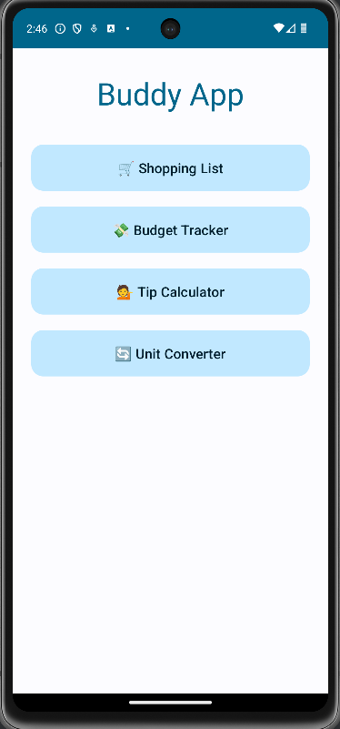
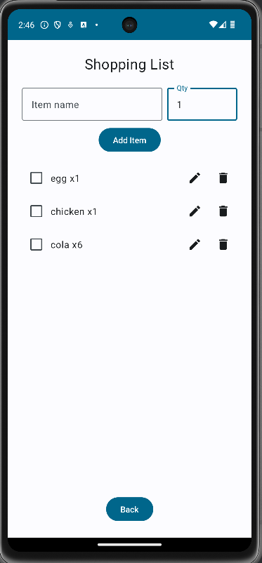
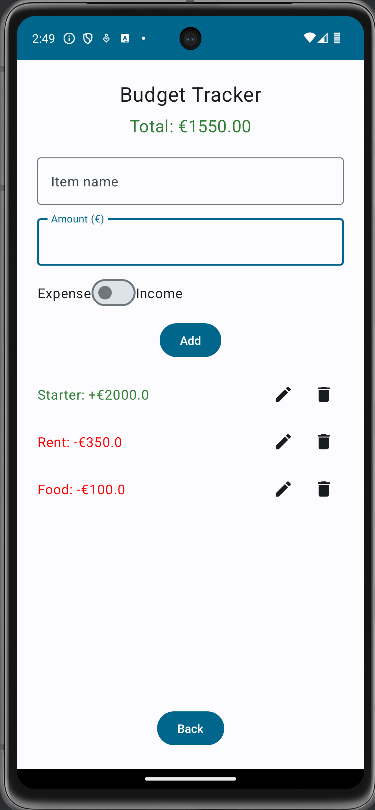
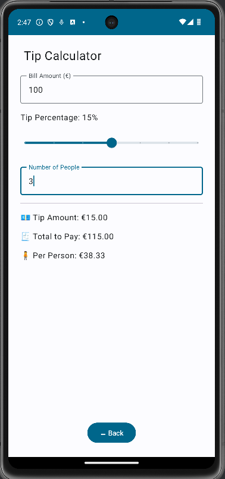
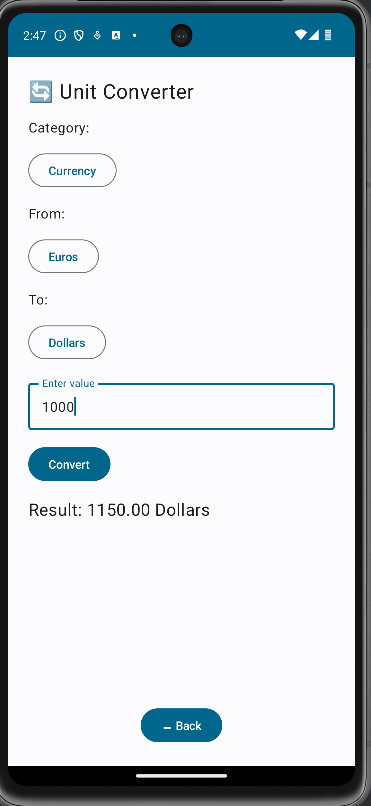

# Buddy App

**Buddy App** is a simple personal Android project developed using **Kotlin**.  
It was created as a hands-on exercise to practice Kotlin and explore modern Android development principles.

---

##  Features

- **Shopping List**  
  Add items with quantities, mark as done, edit, or delete them easily.

- **Budget Tracker**  
  Track your incomes and expenses, with visual total and color-coded balance.

- **Tip Calculator**  
  Quickly calculate tips and split bills among friends.

- **Unit Converter**  
  Convert units of length, weight, temperature, and currency (EUR ↔ USD).

---

##  Screenshots

### 🏠 Home

### 🛒 Shopping List

### 💸 Budget Tracker

### 🧮 Tip Calculator

### 🔄 Unit Converter

---

##  Tech Stack

- **Kotlin**
- **Jetpack Compose** 
- **Material 3**
- **Android Studio**

---

## 🚧 Note
This project was built for educational purposes.  
